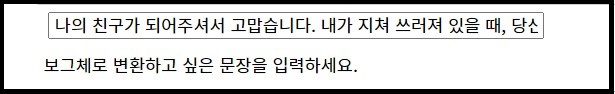

# 보그(Vogue)체 변환기 프로젝트

<br>


> 
>  **🥬 비비드(vivid)한 레드(red) 컬러(color)의 고추가루가 판타스틱(fantastic)한 조화를 이룬 모던(modern)하고 시크(chic)하고 심플(simple)하고 트렌디(trendy)한 잇(it) 김치.**
>
<br>

다음과 같이 한국어로 표현 가능한 단어를 알아 듣기 어려운 외국어 혼용과 만연체를 사용하는 문체를 **보그(Vogue)체** 라고 합니다.<br>


보그체는 여성 패션 잡지, 보그(Vogue)에서 이러한 문장을 사용한 것에 유래 되었습니다.<br>


그리고, 기존보다 문장의 가독성이 떨어지고,  허세가 가득한 인상을 남깁니다.<br>

따라서 이번 자연어 프로젝트에서는 재미를 추구와 외국어의 남용에 대한 경각심을 깨우는 목적으로<br>

일반 문장을 입력하면 보그체로 변환되어 출력되는 <b>보그체 변환기</b>를 만들었습니다. <br><br><br><br>
  
  
> **깃허브**
> 
- [Vogulize-Korean-Converter](https://github.com/Err0RtheMAX/Vogulize-Korean-Converter)<br><br>

> **참조한 오픈소스 및 패키지**
> 
- [네이버 Developers Papago API](https://developers.naver.com/docs/papago/README.md)
- [영어-한글 표기 변환기](https://transliterator.herokuapp.com/)
- [Google 번역](http://translate.google.co.kr)
- [googletrans PyPI](https://pypi.org/project/googletrans/)
- [KoNLPy 파이썬 한국어 NLP](https://konlpy.org/ko/latest/index.html#)<br><br><br><br>

## 요구 환경 및 패키지

- Python 3.XX
- Jupyter notebook 6.XX
- konlpy, json, requests, googletrans (pip, conda)<br><br><br><br>

## 스크린 샷


1. 보그체로 변환시키고 싶은 문장을 입력<br>



2. 보그체로 변환할 때 사용할 번역기 선택<br>

<br>

3. 네이버 파파고를 선택할 때의 보그체로 변환된 문장과 원본 문장 출력<br>

<br>

4. 구글 번역을 선택할 때의 보그체로 변환된 문장과 원본 문장 출력<br>
    
<br><br><br><br>
    

## 동작 과정


1. **사용자가 변환하고 싶은 문장을 입력합니다.**

```jsx
당신의 존재는 내게 힘을 줍니다.
```
<br><br>
2. **입력 받은 문장을 띄어쓰기 공백을 기준으로 각 문자열 원소로 분류하여 Korean_Text 리스트에 저장합니다.**

```
Korean_Text = [’당신의’, ‘존재는’, ‘내게’, ‘힘을’, ‘줍니다.’]
```
<br><br>
3. **KoNLPy 한국어 형태소 분류 패키지의 Okt 방식으로 Korean_Text 리스트의 각 문자열 원소들의 품사를 매치시킵니다.**

```
[[('당신', 'Noun'), ('의', 'Josa')],
 [('존재', 'Noun'), ('는', 'Josa')],
 [('내게', 'Verb')],
 [('힘', 'Noun'), ('을', 'Josa')],
 [('줍니다', 'Verb'), ('.', 'Punctuation')]]
```
<br><br>
4. **Okt를 사용할 때, 분리된 단어와 품사의 묶음은 기본적으로 튜플의 형태인데 이후에 단어 변형에 유용하도록 튜플형태를 리스트형태로 변환시킵니다.**

```
[[['당신', 'Noun'], ['의', 'Josa']],
 [['존재', 'Noun'], ['는', 'Josa']],
 [['내게', 'Verb']],
 [['힘', 'Noun'], ['을', 'Josa']],
 [['줍니다', 'Verb'], ['.', 'Punctuation']]]
```
<br><br>
5. **형태소 분류, 품사 구분지은 리스트를 가지고 보그체로 변형할 때 어떤 번역기를 사용할 지 묻습니다.**
<br><br><br><br>
6. **네이버 파파고를 선택하면 Papago_Vogulize 함수가 동작합니다. Papago_Vogulize 함수에서는 미리 인증 받은 네이버 Developers Papago의 사용자 ID, 비밀키를 Papago API URL에 대입하여 requests 세션을 보냅니다.**
<br><br><br><br>
7. **정상적으로  연결되면 4번에서 만든 리스트를 입력합니다. 분류한 형태소가 Noun, Exclamation일 때, Papago 번역기에 해당 단어를 넣어 영어로 번역합니다. 그 외의 품사를 가지는 형태소는 원형 그대로 반환합니다.**
<br><br><br><br>
8. **영어로 번역된 단어를 영어-한글 표기 변환기 사이트에 한글 표기로 변환할 영어 단어를 입력하고 한글 표기 변환 단어를 반환받습니다.**
<br><br><br><br>
9. **만약 한국어 단어 1개가 2개 이상의 영어 단어로 번역이 되는 경우에는(때 → at the time) 번역된 영단어를 띄어쓰기 공백을 기준으로 분리하고, 분리한 단어를 하나씩 8번 작업을 진행합니다.**
<br><br><br><br>
10. **한글 표기로 변환된 단어와 영어로 변형된 단어를 같이 합쳐서 변형하기 전의 4번 리스트의 변환하기 이전의 단어 인덱스 위치에 그대로 저장합니다.**  

```
[[['당신', 'Noun'], ['의', 'Josa']],
 [['존재', 'Noun'], ['는', 'Josa']]]
```
```
[[['유(You)', 'Noun'], ['의', 'Josa']],
 [['엑시스턴스(existence)', 'Noun'], ['는', 'Josa']]]
```
<br><br>
11. **만약 한글 표기로 변환된 단어가 있을 때 바로 뒤에 붙는 조사가 ‘은’, ‘는’, ‘이’, ‘가’, ‘와’, ‘과’,  ‘을’, ‘를’ 이 온다면, josa_change 함수를 실행하여 주격 조사를 자연스러운 형태로 바꿀지 확인합니다.**
<br><br><br><br>
12. **josa_change 함수에서 ends_with_jongsung 함수를 실행하여, 조사 바로 앞에 있는 글자가 종성이 있는지의 여부를 판단합니다.** 
<br><br><br><br>
13. **ends_with_jongsung 함수에서 주격 조사 앞에 위치하는 글자의 유니코드를 ord로 변환시키고 ‘가’ 라는 글자의 유니코드 값의 차를 28로 나눴을 때 나머지 값이 존재하면 주격 조사 앞에 종성이 있다고 판단하여 상수 값을 반환하고, 그렇지 않으면 주격 조사 앞에 종성이 없다고 판단하여 None을 반환합니다.**
<br><br><br><br>
14. **josa_change 함수에서 알맞는 조사 형태로 변형될 필요가 있으면 다음과 같이  자연스럽게 문장이 연결되도록 조사 형태가 변형됩니다.  (힘을 → 포스(Force)을 → 포스(Force)를)**
<br><br><br><br>
15. **이와 같이 띄어쓰기로 분리된 단어 단위로 7~13번 작업을 문장이 끝날때 까지 반복하고, 변형된 단어마다 vogulized_sentence에 누적시킵니다.**
<br><br><br><br>
16. **최종적으로 보그체로 변환된 vogulized_sentece와 원문과 같이 출력하여 원문이 어떻게 변환되었는지 비교할 수 있습니다.**

```
유(You)의 엑시스턴스(Existence)는 내게 포스(Force)를 줍니다.

당신의 존재는 내게 힘을 줍니다.
```
<br><br>
17. **구글 번역기를 선택했을 때의 경우도 네이버 파파고를 선택했을 때와 비슷하게 6~15번 까지의 과정을 거칩니다. 단, 6번에서 네이버 파파고와 달리  Google_Vogulize 함수가 실행되고, 7번에서 googletrans 패키지의 Translator을 이용하여 공백 단위로 나눠진 단어를 영어로 번역합니다.**

```
유(you)의 엑시스턴스(existence)는 내게 스트렌스(strength)를 줍니다.

당신의 존재는 내게 힘을 줍니다.
```
<br><br>
## 한계
1. 명사 이외의 다른 품사의 단어를 번역하고, 한글 표기로 변환할 때, 변환된 단어 뒤에 붙어야 할 자연스러운 조사의 형태가 명사일 때보다 매우 다양함. 그래서 글자 단위로 분절하는 Okt가 아닌 초/중/종성 단위로 분절이 되는 Kkma, Hananum의 방식이 필요함. 따라서 불가피하게 현재 기능으로는 보그화 하는 단어의 품사를 명사, 감탄사만으로 한정지었음.

    ```
    ex) 밥을 먹는다.  →  라이스(rice)를 이트(eat)한다.
    ex) 밥을 먹으니 배가 부르다. → 라이스(rice)를 이트(eat)<b>하</b>니 쉽(ship)이 풀(full)하다.
    ```
    <br><br>
2. 동사, 형용사 단어를 보그체로 만들기 위해서 Kkma, Hananum 방식을 사용할 때, '가 + -ㅂ니다', '예쁘 + -ㄴ' 와 같이 어간과  어미로 분리가 되는데,  단순히 동사형 어간으로만 영어를 번역하면 다른 의미로 해석이 되는 경우가 있었음. 따라서 정확한 해석을 위해서 '갑니다', '예쁜' 와 같은 형태로 임의적으로 합쳐져서 번역기에 들어가야 함. 그러나 임의적으로 글을 합치는 과정에서 ord를 이용해 글자가 합쳐질 때의 유니코드를 대조해 봤지만 ends_with_jongsung과 같은 규칙화 할 수 있는 패턴을 감지하지 못하였음.<br><br><br><br>

3. 단순히 분절된 단어 단위로 번역기에 넣어 해석하니 문장 전체의 문맥에 맞게 해석을 하지 못한 경우가 있음.

    ```
    ex) 배에서 배를 먹었더니 배가 아프다. → 쉽(ship)에서 쉽(ship)을 먹었더니 쉽(ship)이 아프다.
    ```
<br><br>
